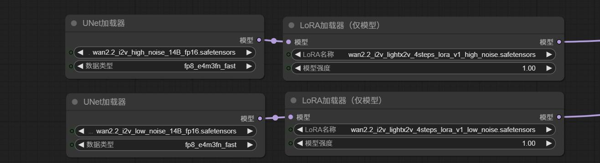
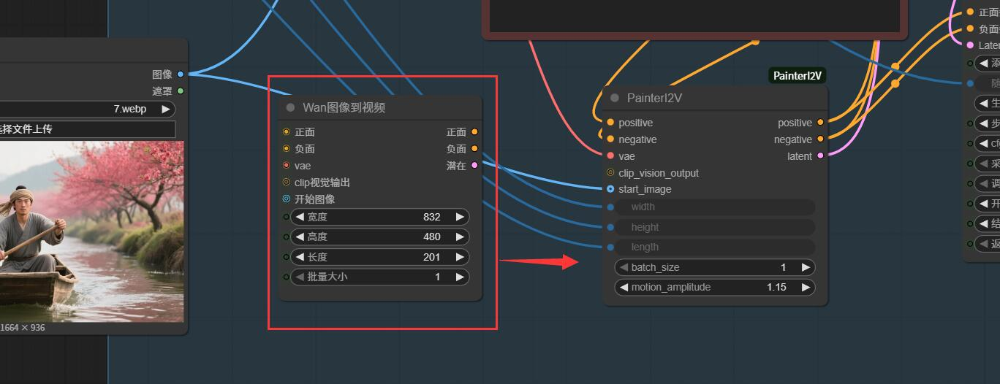

# ComfyUI-PainterI2V  此节点由抖音博主：绘画小子 制作。

Wan2.2 图生视频增强节点，专门针对4步LoRA（如 lightx2v）的慢动作问题进行优化。

2025-12-30，我更新了一个PainterI2V的优化版PainterI2Vadvanced，建议尝试使用。项目地址：https://github.com/princepainter/ComfyUI-PainterI2Vadvanced

如果你用的是KJ的wan2.2-i2v工作流，请使用这个专门为KJ开发的节点，效果一致 (https://github.com/princepainter/ComfyUI-PainterI2VforKJ)

（FirstLastFrameToVideo）首尾帧节点 PainterFLF2V：https://github.com/princepainter/Comfyui-PainterFLF2V

## 🛠 解决的问题

- ✅ 1.减少慢动作：提升运动幅度 15-50%
- ✅ 2.增强运镜：让运镜提示词更听话，运镜幅度更大

  ## 和wan2.2官方节点效果对比

<table>
  <tr>
    <td></td>
    <td></td>
    <td></td>
  </tr>
  <tr>
    <td>motion_amplitude=1.2</td>
    <td>motion_amplitude=1.15</td>
    <td>motion_amplitude=1.15</td>
  </tr>
  <tr>
    <td></td>
    <td></td>
    <td></td>
  </tr>
  <tr>
    <td>motion_amplitude=1.5</td>
    <td>motion_amplitude=1.2</td>
    <td>motion_amplitude=1.15</td>
  </tr>
</table>


以上视频对比效果，我是使用wan2.2官方模型+light2v 4步i2v lora V1.0做的测试（见下图），其他模型使用效果有待各位自行测试

 
## 节点特点
- 单帧输入优化：专为wan2.2单帧图生视频设计
- 即插即用：完全兼容原版 Wan2.2 工作流

## 📦 安装

### 方法 1: ComfyUI Manager（推荐）

1. 打开 ComfyUI Manager  
2. 搜索 PainterI2V  
3. 点击安装  

### 方法 2: 手动安装

```bash
# 进入ComfyUI的custom_nodes目录
cd ComfyUI/custom_nodes

# 克隆仓库
git clone https://github.com/princepainter/ComfyUI-PainterI2V.git
```
# 重启ComfyUI

## 💡 使用方法

### 替换节点

在工作流中将 `WanImageToVideo` 替换为 `PainterI2V`


### 参数设置

- `motion_amplitude`: 1.15（推荐起始值）
- 其他参数与原版保持一致

### 场景参数推荐

| 运动类型         | 推荐参数   | 示例提示词             |
|------------------|------------|------------------------|
| 快速（跑步 / 跳跃） | 1.25–1.35  | "快速向前奔跑"         |
| 正常（走路 / 挥手） | 1.10–1.20  | "流畅地行走"           |
| 动态增强          | 1.00–1.10  | "略微增强动态和运镜"    |

### 提示词优化

- 明确描述运动节奏，如 “快速奔跑”、“流畅行走”
- 避免模糊描述如 “移动”、“走动”

## 🔬 技术细节

| 参数值 | 运动提升 | 亮度变化 | 适用场景     |
|--------|----------|----------|--------------|
| 1.0（原版） | 0%       | 无       | 和WAN原版节点无区别   |
| 1.15（默认）| +15%     | 无       | 通用场景     |
| 1.3    | +30%     | 无       | 体育运动     |
| 1.5    | +50%     | 无       | 极限运动     |

### 核心算法原理

- **亮度保护的运动缩放**：放大运动向量前分离亮度均值  
- **零 latent 初始化**：严格保持 4 步 LoRA 的时序依赖链  
- **参考帧增强**：使用 `reference_latents` 保持主体一致性，不约束运动

## ⚡ 进阶技巧

- 最佳效果：配合强运动提示词使用  
- 运动过快：每次减少 `motion_amplitude` 0.05  
- 仍然偏慢：可适当增大到 1.4

## 🙏 致谢

- Wan2.2 团队：提供惊人的视频生成模型  
- ComfyUI 社区：灵活的节点系统  
🙏如果这个项目对你有帮助，请给颗星 ⭐️ 支持一下！

- # ComfyUI-Painterl2V

This node is created by Douyin creator: 绘画小子

PainterI2V node that specifically fixes the slow-motion issue in 4-step LoRAs (e.g., lightx2v).

2025-12-30现在已经推出升级版PainterI2Vadvanced，建议使用。项目地址：https://github.com/princepainter/PainterI2Vadvanced

The comparative effects in the above video are from my test using the official Wan2.2 model + Light2v 4-step I2V LoRA V1.0. The performance of other models awaits your own testing .

If you're using KJ's wan2.2-i2v workflow, use this node specifically developed for KJ — the effect is consistent.https://github.com/princepainter/ComfyUI-PainterI2VforKJ

## 🛠 Problems Solved

- ✅ Reduces Slow-Motion Drag: Increases motion amplitude by 15-50% 
- ✅ Enhance camera movement: Make the camera movement prompts more responsive and increase the movement amplitude. 
- ✅ Optimized for Single Frame: Designed specifically for single-frame image-to-video workflows  
- ✅ Plug & Play: Fully compatible with original Wan2.2 workflows 

## 📦 Installation

### Method 1: ComfyUI Manager (Recommended)

1. Open ComfyUI Manager  
2. Search for **PainterI2V**  
3. Click **Install**  

### Method 2: Manual Installation

```bash
# Navigate to ComfyUI's custom_nodes directory
cd ComfyUI/custom_nodes

# Clone the repository
git clone https://github.com/princepainter/ComfyUI-PainterI2V.git
```
## 💡 Usage Guide

### Replace the Node

In your workflow, replace `WanImageToVideo` with `PainterI2V`.

### Parameter Settings

- `motion_amplitude`: 1.15 (recommended starting value)  
- Keep all other parameters consistent with the original node.

### Recommended Parameters by Scene

| Motion Type            | Recommended Value | Example Prompt              |
|------------------------|-------------------|-----------------------------|
| Fast (running / jumping) | 1.25–1.35         | "Running forward quickly"   |
| Normal (walking / waving)| 1.10–1.20         | "Walking smoothly"          |
| Motion Enhancement      | 1.00–1.10         | "Slightly enhance motion and camera movement" |

### Prompt Optimization Tips

- Clearly describe motion rhythm, e.g., “run fast”, “walk smoothly”  
- Avoid vague terms like “move” or “walk around”

## 🔬 Technical Details

| Parameter | Motion Boost | Brightness Change | Best For           |
|-----------|--------------|-------------------|--------------------|
| 1.0 (original) | 0%           | None              | No difference from the original WAN node |
| 1.15 (default) | +15%         | None              | General use        |
| 1.3       | +30%         | None              | Sports action      |
| 1.5       | +50%         | None              | Extreme motion     |

### Core Algorithm Principles

- **Brightness-Protected Motion Scaling**: Separates luminance mean before scaling motion vectors  
- **Zero Latent Initialization**: Strictly preserves the temporal dependency chain required by 4-step LoRAs  
- **Reference Frame Enhancement**: Uses `reference_latents` to maintain subject consistency without constraining motion  

## ⚡ Advanced Tips

- Best results: Use with strong motion-related prompts  
- Motion too fast? Reduce `motion_amplitude` by 0.05 increments  
- Still too slow? Try increasing up to 1.4  

## 🙏 Acknowledgements

- Wan2.2 Team: For the amazing video generation model  
- ComfyUI Community: For the flexible node system  
- Contributors & testers: For helping refine this node  

<div align="center">
If you find this project helpful, please give it a star ⭐ to show your support!
</div>
# Restart ComfyUI


